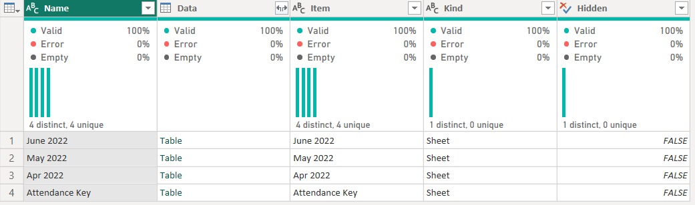
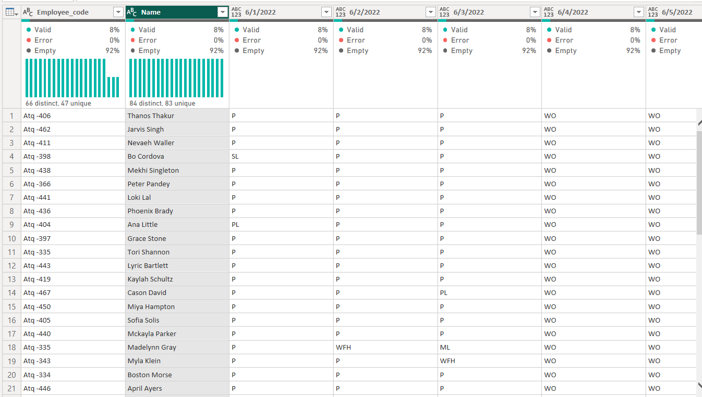
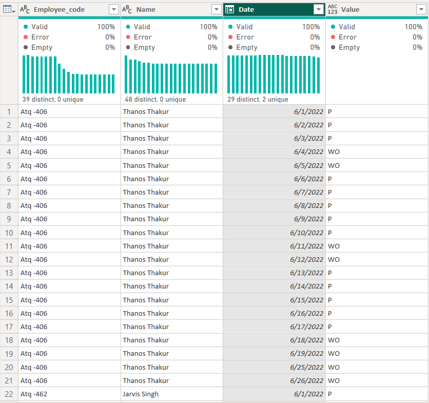

# HR Analytics

HR Analytics has emerged as a critical tool for organizations to effectively manage their workforce and make data-driven decisions. As part of my project, I will be exploring various HR Analytics techniques and their application in the context of talent management. The objective of this project is to analyze HR data to gain insights that can help organizations make better hiring, retention and performance management decisions. With the increasing importance of talent management and the availability of sophisticated data analytics tools, HR Analytics has become an essential component of human resource management. This project aims to shed light on the potential benefits of HR Analytics and provide practical recommendations for organizations looking to implement these techniques in their talent management processes.

## Project Flow Steps 

* <p><a href="#link1">Business Requirement Document & Data Gathering</a></p>
* <p><a href="#link2">Problem Statement</a></p>
* <p><a href="#link3">Main Goal</a></p>
* <p><a href="#link4">Data Cleaning / Data Transformation</a></p>
* <p><a href="#link5">Data Modeling</a></p>
* <p><a href="#link6">DAX</a></p>
* <p><a href="#link7">UI</a></p>

# <h2 id="link1">Business Requirement Document and Data Gathering</h2>
<br>

We are  using the Excel sheet provided by HR manager Pinali to understand their requirements. The client wants to combine three months of data to understand the working preferences of employees between work from home and work from the office. They want to know the percentage of people present in the office on a given week or month and understand why people are taking sick leave.

__Important HR Jargons__
<br>


<br>

# <h2 id="link2">Problem Statment</h2>
<br>

The client wants to gain insights into employee work preferences, attendance, and sick leave patterns to better plan team-building activities, team lunches, and capacity planning. They also want to take necessary measures to prevent illness outbreaks and provide a better working environment for employees.

<br>

# <h2 id="link3">Main Goal</h2>
<br>

Our aims to gather insights and provide solutions for the client by asking the right questions and aligning their solutions accordingly. The goal is to become the client's strategic partner, rather than a one-off solution provider. The data analyst wants to provide insights that can help the client in better capacity planning, save costs, and create a better working environment for employees.We want to find these things:

* __Working Prefreneces of people whether work from home or in office.__
* __How much attendence of people in office or from home.__
* __Find the percentage of sick leaves of people like get the reason of sick leaves e.g : like prople having flu or dengue etc__


<br>

# <h2 id="link4">Data Cleaning / Data Transformation</h2>

The process of data cleaning and transformation is a __crucial step in preparing data__ for analysis. So , we are  demonstrating how to import Excel data into Power BI and automate the process. However, combining Excel files together can create problems of duplicate column names, so we  search for a solution that works with sheets that have different column names. So, we find a blog post that provides a solution and walk the listener through the steps of using Power Query Editor to transform and clean the data. <br>
<a href="https://blog.crossjoin.co.uk/2018/07/09/power-bi-combine-multiple-excel-worksheets/">Link to Blog</a>
<br>

__Tables in excel sheet__


## Steps:

* Using first row as header and remove the top row one and rename some columns <br>


* We apply pivoting on table and create new parameter and call the whole steps as function. <br>

<br>


<br>

### Whole errors and problem we demonstrate 

* As we find a data formatting issue where dates are in separate columns, but we wants them in one column to make data appending easier. To address this issue, they plan to create a template for applying the same transformation to all sheets in an Excel file. They also mention deleting a "change type" step that references column names to make the transformation applicable to other sheets. The author goes on to demonstrate the formatting changes on an April sheet.

* A data transformation process using Power BI to consolidate data from multiple sheets in an Excel file. We explains how to remove unnecessary rows, rename columns, and unpivot data to combine dates into a single column. The goal is to apply this transformation across all sheets in the file, making it easier to view and analyze the data.

<br>

# <h2 id="link5">DAX</h2>

Data Analysis Expressions (DAX) is a programming language that is used throughout Microsoft Power BI for creating calculated columns, measures, and custom tables. It is a collection of functions, operators, and constants that can be used in a formula, or expression, to calculate and return one or more values.

__Measure__

* Attendence Measure and the formula is : 
```
Attendace % = DIVIDE([Present Days],[Office Working days],0)
```

* Half Work from home measure and the formula is :

```
HFWH Count = CALCULATE([Count],'Final Data'[Value]="HWFH")
```

* Office Working ways and the formula is :
```
Office Working days = 
Var totaldays = [Count]

VAR nonworkdays = CALCULATE([Count],'Final Data'[Value] in {"HO", "WO"})

RETURN
totaldays-nonworkdays
```

* Present days in the office and the formula is :
```
Present Days = CALCULATE([Count],'Final Data'[Value] in {"P", "WFH"}) 
```

* Present days in the office and the formula is :
```
WFH % = DIVIDE([WFH Count],'Measures (2)'[Present Days],0)
```

__and there are many more measure in it.__

If you want to see my __Visuals and its working in detail__ . So , Kindly  visit to my __HR_Analytics_Atliq_company.pbix__ 
<br>

# <h2 id="link6">UI/UX Design</h2>
<br>


<br>
